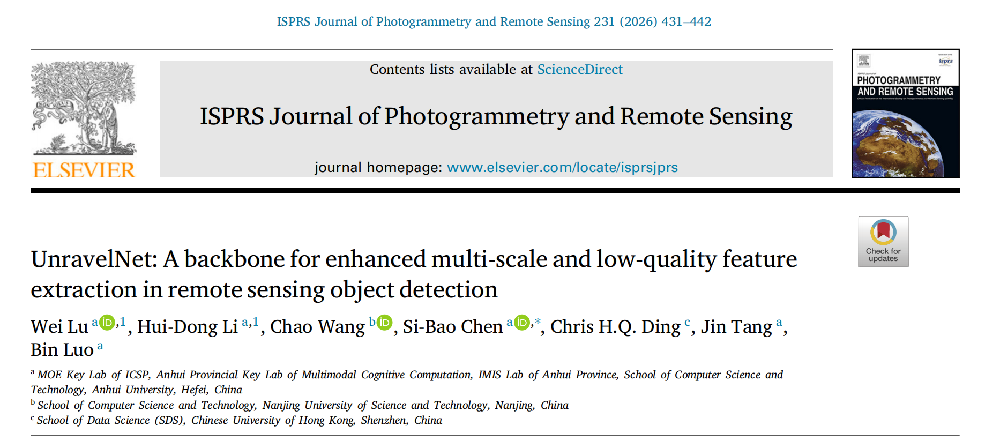

# UnravelNet: A backbone for enhanced multi-scale and low-quality feature extraction in remote sensing object detection


This is the official Pytorch/Pytorch implementation of the paper: <br/>

<p align="center"> 

</p> 

----


<details>
  <summary>
  <font size="+1">Abstract</font>
  </summary>

Remote sensing object detection (RSOD) faces significant challenges, including substantial variations in object sizes within a single image and the presence of low-quality object features. Previous approaches have attempted to mitigate these issues by employing large spatial receptive fields, such as through large kernel convolutions, or by using multi-scale convolutional kernels to capture features from objects of varying sizes. However, large kernel convolutions often fail to extract detailed object features effectively, while multi-scale convolutional kernels struggle to capture relevant features of low-quality or blurry objects, leading to reduced detection accuracy. To address these issues, this study presents UnravelNet, a novel backbone network tailored for RSOD. UnravelNet innovatively disentangles the coupling of multi-scale features through a non-expansive multi-branch attention mechanism, incorporating point, local and mid-range attention. Additionally, UnravelNet improves the representation of low-quality features by integrating edge information and Gaussian distributions. This approach enables UnravelNet to efficiently utilize a limited number of parameters while effectively extracting both multi-scale and low-quality features. Extensive experiments on standard RSOD benchmarks demonstrate the superior performance of UnravelNet, achieving state-of-the-art results with mAPs of 79.99% on DOTA-v1.0, 73.09% on DOTA-v1.5, 69.48% on DIOR-R and 44.44% on FAIR1M-v1.0. These results highlight the improvements in both accuracy and efficiency for RSOD tasks, underscoring the potential of UnravelNet as a robust solution for remote sensing applications.

</details>


## Get Started

Please see [LEGNet](https://github.com/AeroVILab-AHU/LEGNet) for the code, weights and basic usage of MMRotate.


## Acknowledgement
This repository is built using the [timm](https://github.com/rwightman/pytorch-image-models) and [mmrotate](https://github.com/open-mmlab/mmrotate) repositories.
MMRotate is an open source project that is contributed by researchers and engineers from various colleges and companies. We appreciate all the contributors who implement their methods or add new features, as well as users who give valuable feedbacks. We wish that the toolbox and benchmark could serve the growing research community by providing a flexible toolkit to reimplement existing methods and develop their own new methods.

If you have any questions about this work, you can contact me. 

Email: [luwei_ahu@qq.com](mailto:luwei_ahu@qq.com); WeChat: luwei_ahu.

Your star is the power that keeps us updating github.

## Citation
If UnravelNet is useful or relevant to your research, please kindly recognize our contributions by citing our paper:
```
@article{LU2026431,
title = {UnravelNet: A backbone for enhanced multi-scale and low-quality feature extraction in remote sensing object detection},
journal = {ISPRS Journal of Photogrammetry and Remote Sensing},
volume = {231},
pages = {431-442},
year = {2026},
issn = {0924-2716},
author = {Wei Lu and Hui-Dong Li and Chao Wang and Si-Bao Chen and Chris H.Q. Ding and Jin Tang and Bin Luo}
}
```


## License
Licensed under a [Creative Commons Attribution-NonCommercial 4.0 International](https://creativecommons.org/licenses/by-nc/4.0/) for Non-commercial use only. 
Any commercial use should get formal permission first.
